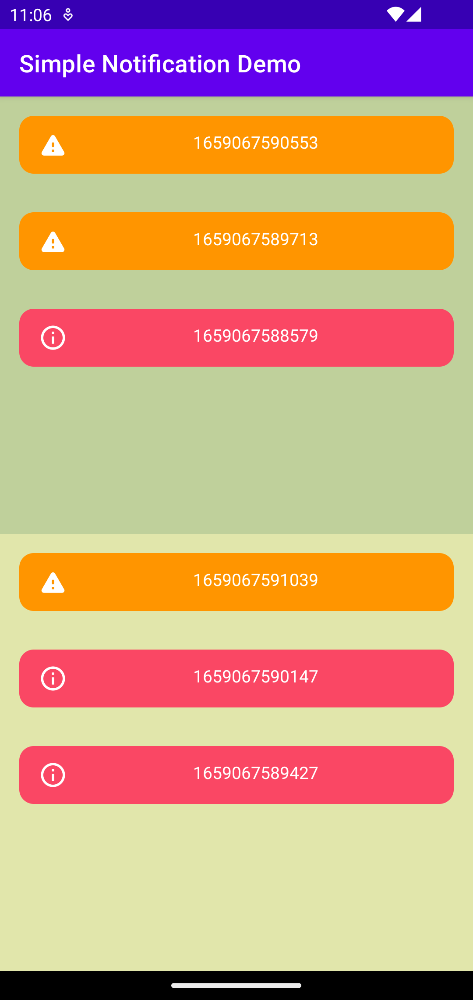

# SimpleNotificationBar


SimpleNotificationBar is an Android library that helps developers to easily create a Notification inside a view group, instead of system view.

---

## Features

### v0.0.1

- Create UI to bind notification
- Create UI for Success, Error, Warning state
- Support Click to dismiss, Swipe to dismiss

---

## Demo



---

## How to use it?

### Setup

On your module's `build.gradle` file add this implementation statement to the `dependencies` section:

```groovy
dependencies {
  implementation 'com.github.trieulh-ict:SimpleNotificationBar:x.x.x'
}
```

Also make sure that Project module includes `jitpack`:

```groovy
allprojects {
    repositories {
        ...
        maven { url 'https://jitpack.io' }
    }
}
```

### Execute in Kotlin

- You can simply call the Notification and bind it to a view group in one line of code:

```kotlin
SimpleNotificationBar
        .bind(viewGroupInstance, config = SimpleNotificationConfig(maxCount = 2, duration = 3000L))
        .makeText(
            SimpleNotificationArg(
                content = "String content here",
                type = SimpleNotificationType.Success // You can choose another types as Error, Warning.
            )
        )
        .show()
```

---

## In the future

The library is still under development, so you can suggest more feature by committing issues to this repository.

---

## License

MIT License

Copyright (c) 2022 Tristan Le

Permission is hereby granted, free of charge, to any person obtaining a copy
of this software and associated documentation files (the "Software"), to deal
in the Software without restriction, including without limitation the rights
to use, copy, modify, merge, publish, distribute, sublicense, and/or sell
copies of the Software, and to permit persons to whom the Software is
furnished to do so, subject to the following conditions:

The above copyright notice and this permission notice shall be included in all
copies or substantial portions of the Software.

THE SOFTWARE IS PROVIDED "AS IS", WITHOUT WARRANTY OF ANY KIND, EXPRESS OR
IMPLIED, INCLUDING BUT NOT LIMITED TO THE WARRANTIES OF MERCHANTABILITY,
FITNESS FOR A PARTICULAR PURPOSE AND NONINFRINGEMENT. IN NO EVENT SHALL THE
AUTHORS OR COPYRIGHT HOLDERS BE LIABLE FOR ANY CLAIM, DAMAGES OR OTHER
LIABILITY, WHETHER IN AN ACTION OF CONTRACT, TORT OR OTHERWISE, ARISING FROM,
OUT OF OR IN CONNECTION WITH THE SOFTWARE OR THE USE OR OTHER DEALINGS IN THE
SOFTWARE.
